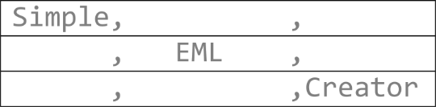
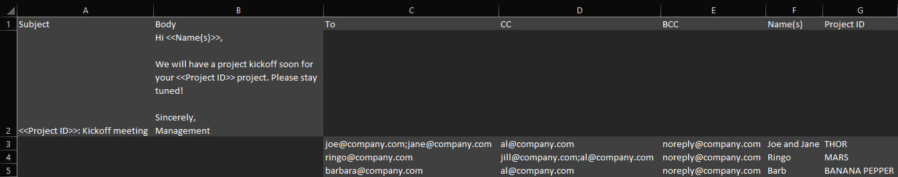

# [atet](https://github.com/atet) / [**_eml_**](https://github.com/atet/eml/blob/main/README.md#atet--eml)

# CSV Templates to Email Drafts†

Did you always wonder why mail merging in popular office suites are so limited? Well wonder no more! 

Generating bulk email drafts usually means limited mail merging features, paying for a SaaS subscription, or trusting your sensitive contact lists to a third-party server.

 **Simple EML Creator** changes that. 

This simple app will allow you to convert a `*.csv` file of templates, email addresses, and variables to `*.eml` draft emails that are ready to be sent by your favorite email client.

[†This was my Google AI Professional Certificate capstone project.](#other-resources)

----------------------------------------------------------------------------

## Table of Contents

* [0. Requirements](#0-requirements)
* [1. Instructions](#1-instructions)
* [2. Next Steps](#2-next-steps)

### Supplemental

* [Other Resources](#other-resources)
* [Troubleshooting](#troubleshooting)

— 

----------------------------------------------------------------------------

## 0. Requirements

This is a **100% client-side, offline-ready** Single-Page Application (SPA) that takes a standard `*.csv` file and instantly generates local `*.eml` email drafts. 

### Why a Single-Page HTML App?

* **Ultimate Privacy:** Your data never leaves your browser. There is no backend, no database, and no API. 
* **Zero Maintenance:** No npm installs, no build steps, and no servers to maintain.
* **Extreme Portability:** The entire application is just one file. You can download the `*.html` file, put it on a USB drive, and run it on a completely air-gapped computer.

— 
[Back to Top](#table-of-contents)

----------------------------------------------------------------------------

## 1. Instructions

### 1.1. Prepare your CSV

Create a spreadsheet and save it as a `*.csv` file (for Microsoft Word, use "`CSV (Comma delimited) (*.csv)`").

* **Required:** You must have a column named "`To`" and multiple emails can be separated by a semicolon ("`;`").
* ***Optional Recipients:*** You can also include "`CC`" and "`BCC`" columns. 
* **Variables:** Any other columns you add (e.g., "`FirstName`", "`InvoiceURL`", "`Department`", etc.) automatically become injectible variables!
* ***Optional Templates***: If you put "`Subject`" and "`Body`" columns in the first row of your CSV, the app will automatically embed your template.
   * To reference variables in your template, use double angle brackets, e.g., "`<<Variable>>`"
   * (In Microsoft Excel) To add newlines in your temple, do not use "`\n`", instead, use `ALT+ENTER` in the cell

Example:

### 1.2. Upload & Configure

1.2.1. Open the app in any modern web browser and click on "`Upload File`" or drag-and-drop your CSV file into the upload zone.

1.2.2. Templates:
   * Templates in "`Subject`" and "`Body`" within the `*.csv` file will automatically be loaded
   * If you didn't have templates in the `*.csv` file, under **Template Configuration**, create your template and click the available variables to inject them into your Subject Line or Email Body.
   * Toggle between "`Plain Text`" and "`HTML`" formatting as needed.

### 1.3. Export & Send

1.3.1. Use the **Live Preview** sandbox to verify your generated drafts look correct.

1.3.2. Click **Download .eml** to download the current draft being viewed, or click **Pack Drafts** at the bottom to download a `*.zip` file containing all your draft emails from your `*.csv` file.

1.3.3. Extract the `*.zip` file and double-click any "`.eml`" file. Files will open directly in your native desktop mail client‡ (e.g., Outlook, Apple Mail, Thunderbird) in **Edit/Draft mode**—ready for you to hit "`Send`"!

‡You must have a default email client that can open "`*.eml`" files and send them out.

— 
[Back to Top](#table-of-contents)

----------------------------------------------------------------------------

## 2. Next Steps

### Build Your Own LLM Micro-Apps!

This app wasn't built by spending weeks setting up a complex JavaScript stack, it was built iteratively by communicating with a Large Language Model (LLM). 

You can build incredibly useful, customized single-page apps for your own daily workflows by leveraging LLMs. Here are some best practices on how to instruct an AI to build apps like this one:

* **Start Simple & Single-File:** Ask the AI to build your idea as a "single-file HTML/CSS/JS app." This eliminates deployment headaches and build steps.
* **Iterate Surgically:** Don't ask the AI to write a perfect app on the first prompt. Get a working prototype, then use prompts like: *"Just show me where to add/modify..."* (This prevents the AI from breaking working code or timing out).
* **Be Specific with Constraints:** State exactly what you want the logic to do. (e.g., *"Make sure it only reads columns named exactly 'To', 'CC'..."*)
* **Mock Up Features:** If you want a specific UI feature, describe it visually. (e.g., *"I want an accordion menu that's closed by default..."*)

The barrier to creating custom software is gone. What will you build next?

— 
[Back to Top](#table-of-contents)

----------------------------------------------------------------------------

## Other Resources

**Description** | **URL Link**
--- | ---
Google AI Professional Certificate (Coursera) | https://grow.google/ai-professional

— 
[Back to Top](#table-of-contents)

----------------------------------------------------------------------------

## Troubleshooting

Issue | Solution
--- | ---
**"It's not working!"** | This concise tutorial has distilled hours of sweat, tears, and troubleshooting; _it can't not work_

— 
[Back to Top](#table-of-contents)

----------------------------------------------------------------------------

Copyright © 2026-∞ Athit Kao, <a href="http://www.athitkao.com/tos.html" target="_blank">Terms and Conditions</a>
